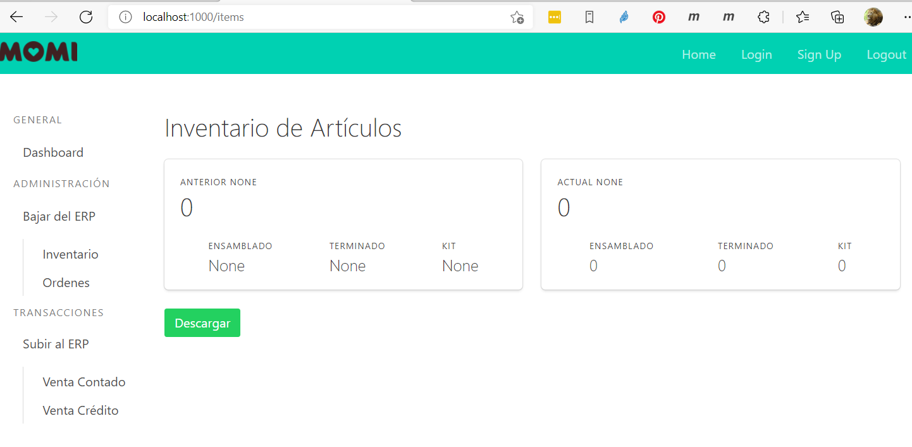

### SISTEMA DE INTEGRACION MOMI - NETSUITE ERP
# Programa para la integración de transacciones de ventas provenientes de los POS y que son enviados via API de Netsuite a la instancia de Momi en la nube.

## Descripción General
El propósito del sistema es proveer una interface que permita que algunas transacciones que ocurren en el POS, puedan registrarse via web API en el ERP Netsuite.  El sistema está desarrollando en lenguaje Python y contiene módulos responsables de establecer una conexión coherente con la plataforma Netsuite en la nube. 

El proceso de transferenecia de cada una las Transacciones está dividido en módulos funcionales relacionados a cada etapa del proceso.  La nomenclatura de los archivos utiliza el nombre de la transacción seguido de un sufijo que indica la función que realiza el módulo:

- bucle de transferencia (xxx_buc.py)
- lectura del origen (xxx_get.py)
- grabación en el destino (xxx_put.py)
- registro del resultado de la operación (xxx_reg.py)

Adicionalmente se tiene rutinas de soporte para las descargas de consultas guardadas en el ERP.  Esto, con el fin de obtener los datos necesarios para que el POS procese las transacciones en concordancia con el ERP:
- Descarga de la consulta guardada de artículos (procecsar_items.py)
- Descarga de la consulta guardada de Ordenes de Venta (procesar_ordenes.py)

## Descripción de los paquetes:

### Paquete momi:
En este paquete es responsable de homologar las clases entre ambos sistemas y por tanto es capaz de tomar la estructura fuente y prepararla para ser enviadas a Netsuite (equivalencias). En el caso de la venta en efectivo por ejemplo, se define una clase cabecera y otra clase detalle y se incluyen los campos de interés necesarios para lograr una transferencia exitosa.
- client.py:  define una clase global ClientDb que responsable de la conexión con la base de datos MySQL
- utility.py: rutinas genericas que realizan funciones de servicio al resto de los modulos
- t_cabecera.py: modelo unificado de la cabecera de la venta contado para ser usado entre el POS  y ERP
- t_detalle.py: modelo unificado del detalle de la venta contado para ser usado entre el POS y el ERP

### Paquete netsuite:
Este paquete ha sido dividido en areas funcionales:
- client.py:  define una clase global NetSuiteClient que contiene el cliente HTTP y un generador de tokens
- commands.py: define las rutinas según las funciones API de netsuite, como por ejemplo upsert y search
- credenciales.py:  define una clase comun Credenciales donde están predefinidos los valores necesarios para generar las conexiones mediante Token Based Authentication (TBA)
- utilidades.py: rutinas genericas que realizan funciones de servicio al resto de los modulos

## Puntos de entrada al sistema (Entry Points)
Los programas pueden ejecutarse desde la línea de comandos del sistema operativo:

Inicializar la base de datos y crear las tablas y vistas.  Este proceso no recrea ninguna tabla por lo que tiene que eliminarse manualmente antes.  Sin embargo si recrea las vistas y los procedimientos almacenados en el definidos.

> python crearDb.py

Ejecutar el proceso de monitoreo y envio de las ventas contados en un bucle:
> python venta_contado_buc.py 

Ejecutar el proceso de descarga de items: 
> python procesar_items.py

Ejecutar el proceso de descarga de ordenes de venta:
> python procesar_ordenes.py

Iniciar el servidor web para la ejecución de las tareas en modo gráfico:
> python wsgi.py

## Requerimientos técnicos:
- Python 3.9 y librerias adicionales (_env/requirements.txt)
- MySQL 8.0

Campos que dependen del InternalId del sandbox y que el POS tiene que manejar:

- Ubicación
- Usuario 
- Cliente Venta Contado
- Forma de Pago
- Vendedor
- Codigo de Articulo
- Codigo de Descuento y Tasa

Campos Custom que son requeridos por la interface:

VENTA CONTADO (CashSale):
- custbody_ad_dn_option_payment (metodo de pago1)
- custbody_ad_dm_payment_amount_1 (metodo de pago2)
- custbodyad_dm_payment_amount_2 (monto de pago2)

ITEMS (vienen en la consulta customsearch_ad_items_pos):
- custitem_ad_item_pos
- custitem_ad_item_group_pos 
- custitem_ad_item_supply_group
- custitem_ad_item_internal_upccode

SALES ORDER - DETALLE (viene en la consulta guardada customsearch_ad_dm_sales_order_details_2):
- custcol_ad_dm_dedication

SALES ORDER - CABECERA (vienen en la consulta guardada customsearch_ad_dm_sales_order):
- custbody_ad_pa_identification (ruc)
- custbody_adc_usuario
- custbody_ad_pa_store
- custbody_ad_dm_date_delivery
- custbody_ad_pa_delivery_time
- custentity_ad_pa_control_digits (dv)

- custentity_ad_pa_id_number  ??

## Funcionalidades por desarrollar 
- Mecanismo de control como por ejemplo una tabla con flags para que ambos sistemas (interface y pos) sepan cuando están trabajando y cuando estan en reposo.  
- Marcado de ordenes cuyo articulo no existe. Tentativo revisar si es posible forzar la actualización de articulos o en su defecto, solo de aquellos que no se encontraron (a partir de su id) mediante un proceso adicional 
- Verificar viabilidad de uso de triggers de MySQL para que dispare acciones del shell.  Ejem https://stackoverflow.com/questions/33170615/call-python-script-from-mysql-trigger.  Nota:  revisar implicaciones de la cola de acciones y manejo de reintentos.

